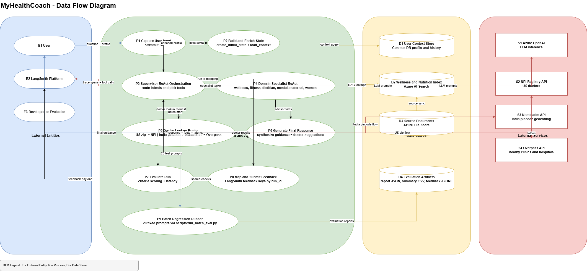
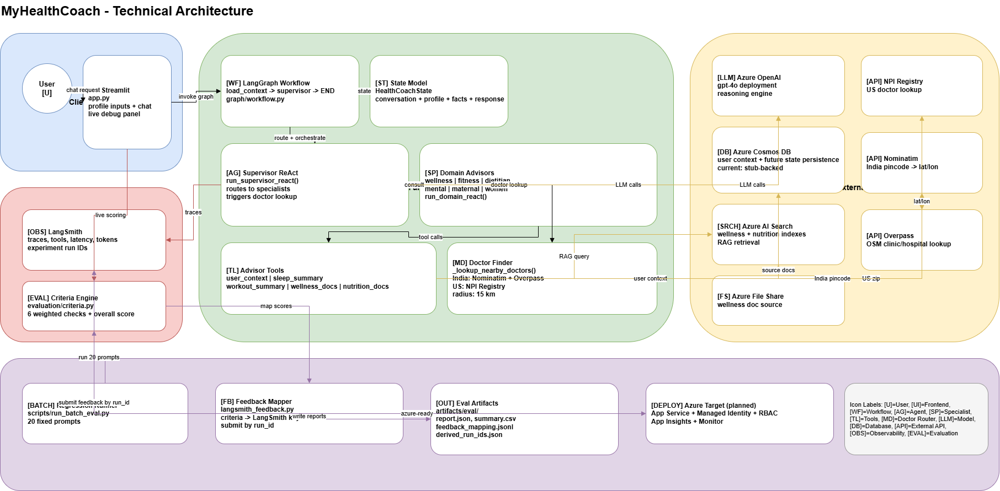

# MyHealthCoach

MyHealthCoach is an agentic AI health coaching application built with Python, Streamlit, LangGraph, LangChain, and LangSmith, with Azure-ready service integrations.

The system uses a supervisor-and-specialist pattern:
- A supervisor ReAct agent interprets user intent and delegates to specialist advisors.
- Specialist ReAct advisors gather evidence using tools and retrieval functions.
- A final synthesis response is generated with practical guidance and safety notes.

## Functional overview

### What the application does
- Accepts a user health question and profile context (gender, age, weight, goal, diet preference, zip/pincode).
- Routes the request to relevant specialist domains:
  - wellness
  - fitness
  - dietitian
  - mental_health
  - maternal_health
  - women_health
- Uses supporting tools for user context, sleep/workout summaries, and wellness/nutrition document retrieval.
- Adds healthcare safety messaging and optional provider lookup prompts.
- Supports nearby provider lookup routing:
  - US zip code: NPI Registry API
  - India pincode: Nominatim + Overpass APIs

### Agentic AI behavior in this solution
- Dynamic routing by a supervisor agent.
- Tool-using specialist agents with scoped capabilities.
- Multi-step orchestration using graph state.
- Traceable execution and run-level evaluation.

## Technical architecture

### Data flow architecture diagram



### Technical architecture diagram



### Core runtime flow
1. Streamlit UI captures prompt and profile in app.py.
2. Initial state is created in src/healthcoach/graph/state.py.
3. Graph executes load_context -> supervisor in src/healthcoach/graph/workflow.py.
4. Supervisor ReAct orchestrates specialist tools in src/healthcoach/agents/react_executor.py.
5. Final response and collected facts are returned to the UI.
6. Evaluation scoring and optional LangSmith feedback mapping are produced.

### Main components
- UI: app.py
- Agent logic: src/healthcoach/agents/react_executor.py
- Graph orchestration:
  - src/healthcoach/graph/workflow.py
  - src/healthcoach/graph/nodes.py
  - src/healthcoach/graph/state.py
- Service integrations:
  - src/healthcoach/services/llm.py
  - src/healthcoach/services/clients.py
  - src/healthcoach/services/health_data.py
- Evaluation:
  - src/healthcoach/evaluation/criteria.py
  - src/healthcoach/evaluation/langsmith_feedback.py
- Batch evaluation script: scripts/run_batch_eval.py

## Repository structure

```text
myHealthCoach/
  app.py
  requirements.txt
  .env.example
  docs/
    AI_AgenticAI_MyHealthCoach_Fundamentals.pptx
    dfd_mhc.drawio
    chat_dfd.drawio
    tech_mhc.drawio
  scripts/
    run_batch_eval.py
  src/healthcoach/
    agents/
      react_executor.py
    config.py
    evaluation/
      criteria.py
      langsmith_feedback.py
    graph/
      nodes.py
      state.py
      workflow.py
    services/
      clients.py
      health_data.py
      llm.py
```

## Prerequisites

- Python 3.11+
- Conda or venv
- Azure OpenAI resource (for non-fallback model behavior)
- Optional but recommended:
  - Azure Cosmos DB
  - Azure AI Search
  - Azure Storage
  - LangSmith account/API key

## Configuration

### 1. Install dependencies

```powershell
pip install -r requirements.txt
```

### 2. Configure environment variables

Create .env from .env.example and set your values.

Required for full model-driven behavior:
- AZURE_OPENAI_ENDPOINT
- AZURE_OPENAI_API_KEY
- AZURE_OPENAI_DEPLOYMENT
- AZURE_OPENAI_API_VERSION

Optional integrations:
- COSMOS_ENDPOINT
- COSMOS_DATABASE_NAME
- COSMOS_STATE_CONTAINER
- COSMOS_USER_CONTAINER
- COSMOS_WORKOUT_CONTAINER
- AZURE_SEARCH_ENDPOINT
- AZURE_SEARCH_API_KEY
- AZURE_SEARCH_WELLNESS_INDEX
- AZURE_SEARCH_NUTRITION_INDEX
- AZURE_STORAGE_CONNECTION_STRING
- AZURE_FILE_SHARE_NAME

Tracing and evaluation:
- LANGSMITH_TRACING=true
- LANGSMITH_API_KEY
- LANGSMITH_PROJECT=myhealthcoach

### Security note

Do not commit real keys or connection strings.
If sensitive values were previously committed to any file, rotate them before publishing this repository.

## Run locally

```powershell
streamlit run app.py
```

Open the local URL shown in terminal, typically http://localhost:8501.

## How to use the app

1. Set user profile in the sidebar.
2. Enter a health query in chat input.
3. Review assistant response.
4. Enable Show agent facts to inspect collected facts and evaluation details.

Example query:
- i am a pre diabatic patient

Expected response characteristics:
- structured guidance (diet, exercise, wellness)
- safety note and escalation language
- optional provider-finder follow-up

## Evaluation and regression workflow

Run batch evaluation:

```powershell
python scripts/run_batch_eval.py
```

Generated artifacts are written under artifacts/eval, including:
- batch_eval_report.json
- batch_eval_summary.csv
- langsmith_feedback_mapping.jsonl

Optional direct feedback submission to LangSmith:

```powershell
python scripts/run_batch_eval.py --submit-to-langsmith --run-ids-file <path_to_mapping.json>
```

Or auto-derive case_id -> run_id from an experiment export:

```powershell
python scripts/run_batch_eval.py --submit-to-langsmith --experiment-export-file <path_to_export.jsonl>
```

## Current implementation status

- Implemented:
  - Supervisor + specialist ReAct architecture
  - US and India provider lookup routing
  - Live evaluation scoring and feedback mapping
  - Batch regression flow
- In progress / next integration steps:
  - Full Cosmos DB read/write integration
  - Full AI Search indexed retrieval content
  - Production deployment hardening

## Deployment guidance

### Application deployment options
- Azure App Service (recommended first path)
- Container-based deployment later if needed

### Minimum production checklist
- Move all secrets to secure secret management (for example Key Vault).
- Enable managed identity and RBAC for Azure services.
- Configure Application Insights and alerts.
- Enforce dependency and vulnerability scanning in CI.
- Add automated regression run as part of PR validation.

## Pre-commit secret protection

This repository includes a pre-commit setup that blocks commits when potential secrets are detected.

Configured checks:
- gitleaks secret scan
- private key detection
- merge conflict marker detection

### One-time setup

```powershell
pip install pre-commit
pre-commit install
```

### Run manually on all files

```powershell
pre-commit run --all-files
```

If a commit is blocked, remove or replace sensitive values with placeholders and commit again.

## Publish to Git repository

1. Ensure .env and any secret files are in .gitignore.
2. Remove or rotate exposed keys.
3. Add README and architecture diagrams under docs.
4. Commit and push.

Example:

```powershell
git init
git add .
git commit -m "Initial commit: MyHealthCoach agentic AI app"
git branch -M main
git remote add origin <your_repo_url>
git push -u origin main
```

## Documentation assets

Project teaching and architecture materials are included in docs:
- AI_AgenticAI_MyHealthCoach_Fundamentals.pptx
- tech_mhc.drawio
- tech_mhc.drawio.png
- dfd_mhc.drawio
- dfd_mhc.drawio.png
- chat_dfd.drawio
